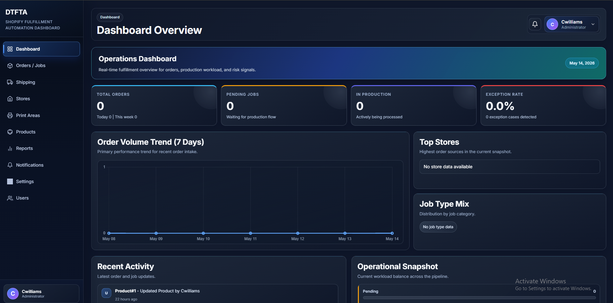
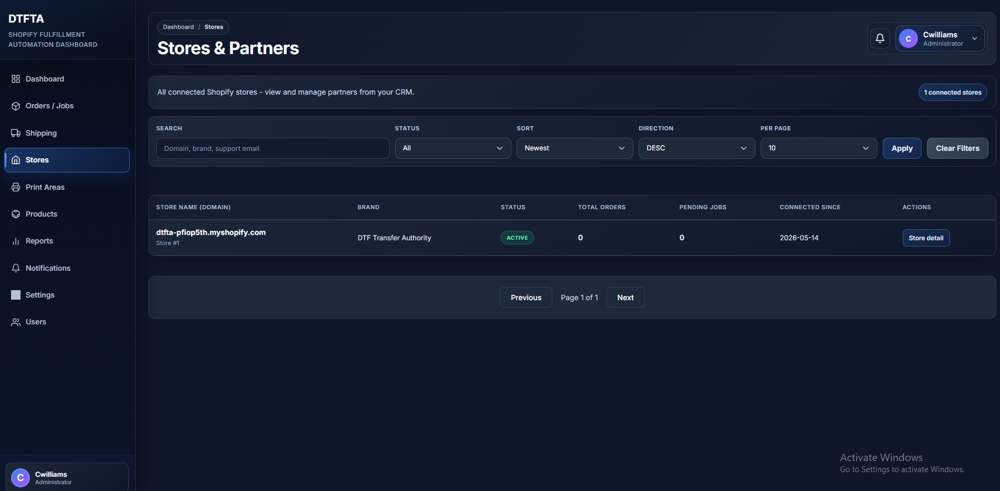

# DTFTA Project — Backend

**DTFTA** is a Shopify fulfillment platform in the same space as Printify: merchants design and sell custom products in their stores, while DTFTA handles production and shipping as **white-label** fulfillment (the merchant’s brand stays primary, not DTFTA’s). The product is aimed at a **public** Shopify app with **subscription-style billing** and **usage-based charges** (for example per order or store), enforced through Shopify Billing and related server-side configuration.

This document describes the **backend (Laravel) application** only: how to install and run the PHP service, database, queues, and Shopify-facing server configuration. Asset pipelines and other front-end tooling are not part of these steps.

### Backend scope

- **Laravel 12** (PHP 8.2+): HTTP APIs, OAuth and webhook handling, fulfillment and billing logic, scheduled and queued jobs.
- **Shopify integration** on the server: app credentials, scopes, webhook verification, fulfillment services, and billing APIs (see `.env.example` for variable names).
- **Admin CRM** served by Laravel (Blade): stores, orders, products, print areas, artworks, reports, and settings—all backed by the same app and database.

---

## Requirements

| Tool | Notes |
|------|--------|
| **PHP** | `^8.2` with common extensions (`openssl`, `pdo`, `mbstring`, `tokenizer`, `xml`, `ctype`, `json`, `fileinfo`, `curl`). |
| **Composer** | 2.x |
| **Database** | `.env.example` uses **MySQL** placeholders (`DB_*`). You can switch to **SQLite** by setting `DB_CONNECTION=sqlite` and pointing `DB_DATABASE` at `database/database.sqlite`. |

Optional: **AWS S3** when `FILESYSTEM_DISK=s3` (see `.env.example` and `config/filesystems.php`). The project name for the public disk URL env is `AWS_COULD_FRONT_URL` (matches the key used in this codebase).

---

## Installation (backend only)

Clone the repository and open a terminal in the **project root** (the directory that contains `artisan` and `composer.json`).

1. **Install PHP dependencies**

   ```bash
   composer install
   ```

2. **Environment file**

   Windows (cmd/PowerShell):

   ```bash
   copy .env.example .env
   ```

   macOS / Linux:

   ```bash
   cp .env.example .env
   ```

3. **Application key**

   ```bash
   php artisan key:generate
   ```

4. **Database**

   - **MySQL / MariaDB** (matches `.env.example`, typical for WAMP): create an empty database, set `DB_CONNECTION=mysql` and `DB_HOST`, `DB_PORT`, `DB_DATABASE`, `DB_USERNAME`, `DB_PASSWORD` in `.env`, then:

     ```bash
     php artisan migrate
     ```

   - **SQLite**: set `DB_CONNECTION=sqlite` and `DB_DATABASE=database/database.sqlite`, create the file if needed, then `php artisan migrate`.

5. **Environment variables**

   Copy `.env.example` to `.env`, then set the values below for your environment. **Never commit a real `.env`**; keep secrets out of version control.

   | Group | Variables | Purpose |
   |--------|-----------|---------|
   | **Application** | `APP_NAME`, `APP_ENV`, `APP_DEBUG`, `APP_URL` | App identity, environment, and the canonical public base URL (used for links, billing return URL, and Shopify redirects). Run `php artisan key:generate` for `APP_KEY`. |
   | **Database** | `DB_CONNECTION`, `DB_HOST`, `DB_PORT`, `DB_DATABASE`, `DB_USERNAME`, `DB_PASSWORD` | Primary database (MySQL in the example file; SQLite optional). |
   | **Session / queue / cache** | `SESSION_DRIVER`, `SESSION_*`, `QUEUE_CONNECTION`, `CACHE_STORE`, `BROADCAST_CONNECTION` | Defaults in `.env.example` use the database for session, queue, and cache—ensure migrations have run. |
   | **Filesystem** | `FILESYSTEM_DISK` | `local` for development uploads; set `s3` and fill **AWS** keys when using S3 storage. |
   | **Shopify** | `SHOPIFY_API_KEY`, `SHOPIFY_API_SECRET`, `SHOPIFY_API_PASSWORD` | App credentials from Shopify Partners. `SHOPIFY_API_SECRET` is the client secret; `SHOPIFY_API_PASSWORD` is optional (legacy/custom apps). |
   | **Shopify API** | `SHOPIFY_API_VERSION`, `SHOPIFY_WEBHOOK_API_VERSION`, `SHOPIFY_SCOPES` | Admin API version, webhook subscription API version, and OAuth scopes (must match your app configuration). |
   | **Shopify security** | `EXTERNAL_API_SECRET`, `SHOPIFY_WEBHOOK_SECRET` | `EXTERNAL_API_SECRET` is used for app/signature verification (`AppSignatureVerifier`); webhook HMAC uses `SHOPIFY_WEBHOOK_SECRET`. Often the same as the client secret in dev; set explicitly per environment. |
   | **Shopify URLs** | `SHOPIFY_APP_URL` | Public HTTPS base URL for the app (Partners app URLs and tunneling); defaults in the example follow `APP_URL`. |
   | **Webhooks (dev)** | `WEBHOOK_DEBUG` | Extra webhook logging—set `false` in production. |
   | **Mail** | `MAIL_MAILER`, `MAIL_HOST`, `MAIL_PORT`, `MAIL_USERNAME`, `MAIL_PASSWORD`, `MAIL_ENCRYPTION`, `MAIL_FROM_ADDRESS`, `MAIL_FROM_NAME` | Outbound email (e.g. SMTP or `log` for local). |
   | **AWS / CDN** | `AWS_ACCESS_KEY_ID`, `AWS_SECRET_ACCESS_KEY`, `AWS_DEFAULT_REGION`, `AWS_BUCKET`, `AWS_USE_PATH_STYLE_ENDPOINT`, `AWS_COULD_FRONT_URL` | Required when `FILESYSTEM_DISK=s3`. `AWS_COULD_FRONT_URL` is the public asset base URL (spelling matches `config/filesystems.php` and `config/app.php`). |
   | **Vite (optional)** | `VITE_APP_NAME` | Only needed if you build front-end assets with Vite; not required for backend-only API/queue operation. |
   | **Billing** | `BILLING_ENFORCEMENT_ENABLED`, `SHOPIFY_BILLING_TEST_MODE`, `SHOPIFY_BILLING_PLAN_NAME`, `SHOPIFY_BILLING_RETURN_URL`, `SHOPIFY_BILLING_BASE_PRICE_AMOUNT`, `SHOPIFY_BILLING_PER_ORDER_AMOUNT`, `SHOPIFY_BILLING_USAGE_CAP_AMOUNT`, `SHOPIFY_BILLING_CURRENCY_CODE` | Managed billing and usage caps (`config/services.php` under `shopify.billing`). |

---

## Running the backend locally

Typical local run (two terminals, or equivalent process manager):

1. **HTTP application**

   ```bash
   php artisan serve
   ```

2. **Queue worker** (required when `QUEUE_CONNECTION=database` or similar, so webhooks and jobs are processed)

   ```bash
   php artisan queue:listen --tries=1 --timeout=0
   ```

For **WAMP** (or another Apache/nginx vhost), point the site **document root** to the `public/` directory, enable URL rewriting if needed, and run the queue worker separately as above.

---

## Tests

```bash
composer run test
```

---

## License

See `composer.json` (Laravel skeleton is MIT unless your organization has added a different top-level license file).

Preview Screenshot:



